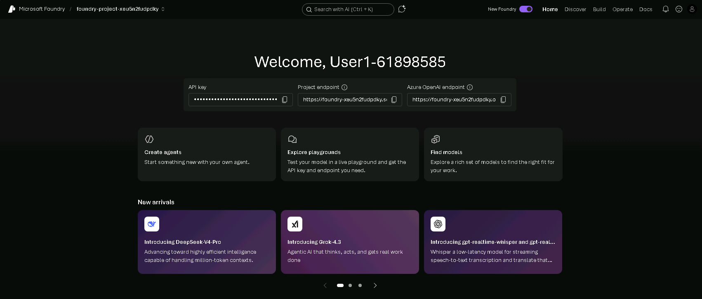

# Workshop 2: Explore Claude In Microsoft Foundry

**Congratulations**. You just completed the Cupcake workshop and learned how to create, deploy, and use, your first AI agent with Claude Code. Now, let's use Jupyter notebooks as a sandbox to explore more interesting scenarios with Claude models on Microsoft Foundry.


## Prerequisites

- An Active Azure Subscription (provided by Skillable)
- An existing Microsoft Foundry project (pre-provisioned in subscription)
- A Python 3.10+ environment with a VS Code IDE for development

## Step 1: Verify Current Status

At this time you should have:

- [X] An open Skillable VM with an active Azure subscriptio
- [X] An open Edge browser pointing to [https://ai.azure.com](https://ai.azure.com) and logged in
- An existing Foundry project in that account - with a Home page like this:

    

**‼️ Keep this tab open. We'll return to it soon**

===

## Step 2: Launch GitHub Codespaces

For this workshop, we will be using Jupyter notebooks as a sandbox to explore Claude and Foundry features. Let's start by forking the repo to get a personal copy, then launching GitHub Codespaces to get a pre-configured dev environment with minimal effort.

- [X] Visit [https://aka.ms/model-mastery/workshop](https://aka.ms/model-mastery/workshop)
- [X] Click the **Fork** button to create a personal copu
- [X] Click the blue **Code** button - and select the **Codespaces** tab
- [X] Click **Create a new Codespace..** - and wait till this loads.

This final step should open a new browser tab with a VS Code editor. Wait till this is loaded completely and you see an active terminal. _This may take a few minutes_.

===

## Step 3: Configure Local Environment

1. Create a `.env` file using the provided sample using this command:

    ```bash
    cp sandbox/sample.env ./.env
    ```

1. Open `.env` in your editor - you should see 3 variables defined:

    ```bash
    FOUNDRY_ENDPOINT="https://<your-resource>.services.ai.azure.com/anthropic"
    FOUNDRY_API_KEY="<your-api-key>"
    FOUNDRY_MODEL_DEPLOYMENT="claude-sonnet-4-6"
    ```
1. Update the values by referencing the Microsoft Foundry Portal page in Step 1.

    - Set `FOUNDRY_API_KEY` to the **API Key** value on that page
    - Replace `<your-resource>` in FOUNDRY_ENDPOINT` with the resource name in Foundry Endpoint
    - Leave the `FOUNDRY_MODEL_DEPLOYMENT` value unchanged


===

## Step 4: Validate Local Environment

The GitHub Codespaces should have pre-installed the dependencies in `sandbox/requirements.txt` - let's validate it:

1. Verify Python environment - should show version 3.12+

    ```bash
    python --version
    ```

1. Verify Microsoft Agent Framework is installed - should show valid version.

    ```bash
    pip show agent-framework
    ```

1. If you want to install the missing dependencies manually, run:

    ```bash
    pip install -r sandbox/requirements.txt
    ```

**Congratulations** - You have a Foundry project deployed in Microsoft Foundry, and a GitHub Codespaces environment configured with all required dependencies and credentials.


===

## Step 5: View The Jupyter Notebooks

The sandbox environment has two notebooks we will use today. We recommend running them in order - both load `.env` from the repo root via `load_dotenv(dotenv_path="../.env")`. Take a minute to locate them in the `sandbox/` folder in your Codespaces environment.

### 1. [`01-foundry-e2e.ipynb`](00-foundry-e2e.ipynb) — End-to-End Agent Development

Walk the full Foundry workflow in a single notebook, using the fictional **Contoso Outdoors** internal policy assistant as the running scenario. You go from picking a model in the catalog to a production-ready agent, covering:

- **Model selection** — models, deployments, endpoints, and keys in Foundry
- **Agent creation** — a stateful agent with role, instructions, and policy boundaries using the `agent-framework` SDK
- **Tracing & observability** — instrumenting with OpenTelemetry
- **Evaluation** — running local evaluators for quality and groundedness
- **Red teaming** — pressure-testing safety and refusal behavior
- **Deployment** — what it takes to ship the agent

Use this notebook to build the mental model of the Foundry journey end-to-end. Run the cells top-to-bottom the first time through.

### 2. [`02-code-generation.ipynb`](04-code-generation.ipynb) — Code Generation & Analysis

Use **Claude Sonnet 4.6** as a senior engineering partner against the fictional **Contoso Financial** modernization scenario (Java/COBOL → Python on Azure). The notebook focuses on practical, code-centric prompting patterns:

- Generating production-style code from detailed specifications
- Reviewing and debugging code for bugs, security, and design issues
- Translating legacy code into idiomatic modern Python
- Generating test suites to safely refactor
- Multi-turn sessions for iterative refinement
- Producing Infrastructure as Code (Bicep / Terraform) for Azure

Use this notebook to build intuition for high-leverage prompts in real code workflows. Swap in your own snippets and specs to see how the model responds to your domain.

===

## Step 6: Run A Notebook Cell-By-Cell

Notebooks are designed for **interactive exploration** — you run one cell, read the output, think about it, then run the next. Don't just "Run All" and walk away. The narrative between cells is where the learning happens.

1. **Open the notebook.** In the VS Code Explorer (left sidebar), expand the `sandbox/` folder and click `01-foundry-e2e.ipynb`. The notebook opens in the editor area.

1. **Select the Python kernel.** In the top-right of the notebook, click **Select Kernel** (or the kernel name if one is already chosen).

    - Pick **Python Environments...** → the Python 3.12+ interpreter shown in the list.
    - The kernel name should now appear in the top-right and a green dot indicates it's connected. If you don't see a suitable kernel, run `pip install -r sandbox/requirements.txt` from Step 4 and retry.

1. **Clear any existing outputs.** The notebook may have sample outputs from a previous run. Clear them so you see your own results:

    - Click the **`...`** (More Actions) menu in the notebook toolbar → **Clear All Outputs**.
    - Confirm. All code cells should now show no output.

1. **Use the Outline view to see the workshop flow.** Before you start running cells, get the lay of the land:

    - Open the **Outline** view in the Explorer sidebar (scroll down — it's collapsed by default), **or** press `Ctrl+Shift+O` (Windows/Linux) / `Cmd+Shift+O` (macOS) to jump through headings.
    - The Outline lists every Markdown heading in the notebook — this is the step-by-step structure of the workshop (Model Selection → Agent Creation → Tracing → Evaluation → Red Teaming → Deployment).
    - Click any heading in the Outline to jump straight to that section. Use it as your table of contents while you work through the notebook.

1. **Run cells one at a time.** Click into the first cell and use one of these:

    - Click the ▶ (Run) button to the left of the cell, **or**
    - Press `Shift+Enter` — this runs the current cell and moves focus to the next one.

    After each code cell:

    - Read the output below the cell.
    - Read the next Markdown cell — it explains *why* you just ran what you ran and *what to look for*.
    - Only then move on to the next code cell.

1. **Iterate freely.** If something is interesting, edit the prompt or parameters in the cell and re-run it with `Shift+Enter`. Notebooks are a sandbox — break things, change prompts, try alternative models. Variables persist across cells until you restart the kernel (**`...`** → **Restart Kernel**).

1. **Tip:** If a cell errors out, fix it and re-run just that cell — you don't need to restart from the top unless the kernel state is corrupted.

Once you've worked through `00-foundry-e2e.ipynb`, repeat the same process for `04-code-generation.ipynb`.


===

## Recap

Nice work - you just went hands-on with Claude Sonnet 4.6 on Microsoft
Foundry from a real developer environment. In a single sandbox session,
you:

- ✅ Forked the workshop repo and spun up a **GitHub Codespaces**
  environment with all dependencies pre-installed - no local Python
  setup required.
- ✅ Wired up a Foundry **endpoint, API key, and model deployment**
  through a local `.env` file, the same pattern you'd use for any
  production app.
- ✅ Walked the **end-to-end Foundry workflow** in
  `00-foundry-e2e.ipynb` — model selection, agent creation, tracing
  with OpenTelemetry, evaluation, red teaming, and deployment — using
  the Contoso Outdoors policy assistant scenario.
- ✅ Used Claude as a **senior engineering partner** in
  `04-code-generation.ipynb` — generating production-style code,
  reviewing for bugs and security issues, translating legacy
  Java/COBOL to Python, generating tests, and producing Bicep /
  Terraform IaC for Azure.
- ✅ Learned the **notebook-driven exploration loop**: select a
  kernel, clear outputs, navigate with the **Outline** view, and run
  cells one at a time with `Shift+Enter` so the narrative between
  cells does the teaching.

The pattern you just used - **Foundry for the model, the Agent
Framework for the glue, notebooks for iterative exploration** - is the
same one you'd reach for when prototyping any new agent or
code-assist scenario before promoting it to a service.

### Where to go next

- **Bring your own scenario.** Replace the Contoso Outdoors policy text or
  the Contoso Financial Java/COBOL snippets with your real domain content
  and re-run the evaluation and code-review cells against it.
- **Wire the agent into MCP.** Take the agent you built in
  `00-foundry-e2e.ipynb` and connect it to the Cupcake MCP server
  (or one of your own) so it can call live tools.
- **Promote the prototype.** Move the agent code out of the notebook
  into a small FastAPI or Azure Functions app, keep the tracing and
  evaluation hooks, and you have the skeleton of a production
  service.
- **Explore other capabilities.** Try using Claude Code for reasoning, multi-modal and multi-turn conversations with AI Agents. Tell us what you learned.


**Thanks for building with us - now go ship something. 🚀**
