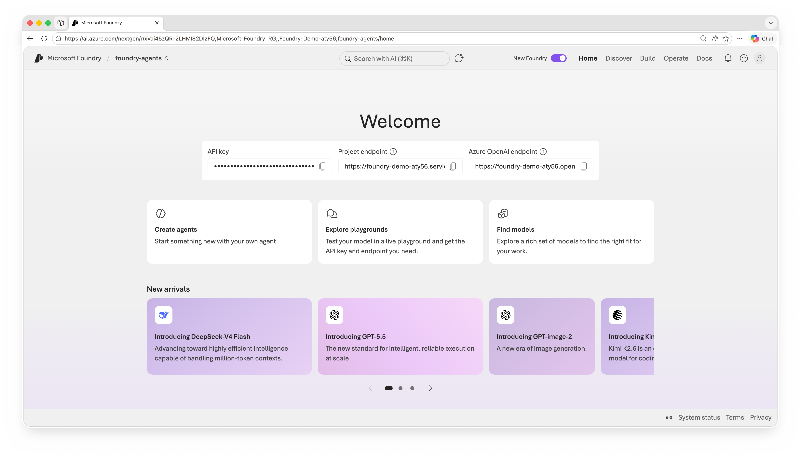

## Part 1 - Log in to Microsoft Foundry

1. Open `https://ai.azure.com` in your browser.
2. Sign in with the details below:    
    **Username**: +++@lab.CloudPortalCredential(User1).Username+++    
    **Password (TAP)**:  +++@lab.CloudPortalCredential(User1).AccessToken+++     
3. In the top bar, toggle the **New Foundry** switch on.
4. Your **project** is selected by default - no need to pick one.

---

✅ **In this step you have:** signed in to Microsoft Foundry, switched on the
**New Foundry** experience, and confirmed your project is selected.

➡️ Click **Next** to find a model and try it out in the Playground.

