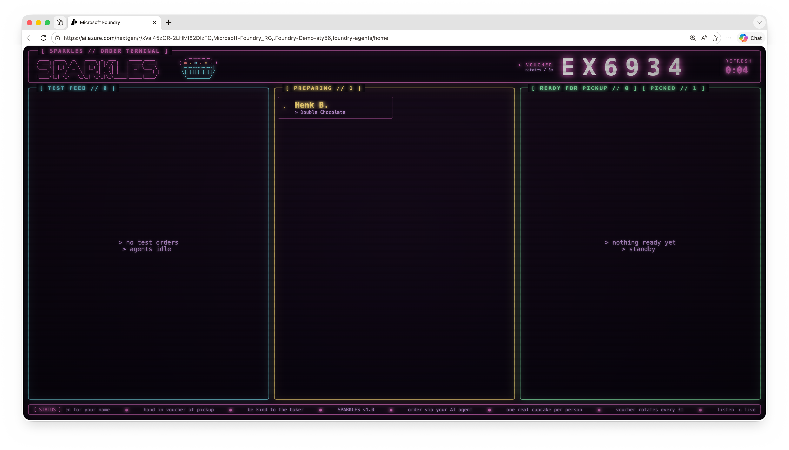

## Part 4 - Build the Agent

With Foundry on the line, time to write some code. You'll be using the
**Microsoft Agent Framework** - a small Python library that wraps a chat
model, a session (the conversation history), and any tools you give it
into a single 'Agent' object you can talk to.

### Setup

In Visual Studio Code, open a new terminal (**Terminal > New Terminal**).
It opens in 'c:\agents' - the folder where the workshop code lives.

The Python dependencies are already installed on the lab VM. For
reference, here's what's in 'requirements.txt':

```
agent-framework
agent-framework-foundry
python-dotenv
```

- 'agent-framework' - the core 'Agent', sessions, and tool plumbing.
- 'agent-framework-foundry' - the Foundry-specific chat clients (this is
  what knows how to talk to your Anthropic deployment on Foundry).
- 'python-dotenv' - loads your '.env' file into environment variables.

Create an empty 'agent.py' file in the same folder. You'll build it up in
three small steps - run it after each step to see the agent grow.


### Step 1 - Hello World Agent

Start with a minimal agent that just talks to the model. No tools, no
persona - just confirm we can reach Foundry. Three pieces show up here
that you'll see in every agent you build:

- **Chat client** - the connection to the model. 'AnthropicFoundryClient'
  knows how to call your Claude deployment on Foundry using the values
  from '.env'.
- **Agent** - wraps the chat client (and later, tools and instructions).
- **Session** - holds the conversation history so the agent remembers
  what was said earlier in the chat.

```python
"""Sparkles - The Cupcake ordering agent"""

import asyncio
import os

from dotenv import load_dotenv

from agent_framework import Agent
from agent_framework.foundry import AnthropicFoundryClient

# 1. Load environment variables from .env
load_dotenv()


async def main() -> None:
    # 2. Configure the chat model (Claude on Microsoft Foundry)
    chat_client = AnthropicFoundryClient(
        model=os.environ["FOUNDRY_MODEL_DEPLOYMENT"],
        api_key=os.environ["FOUNDRY_API_KEY"],
        base_url=os.environ["FOUNDRY_ENDPOINT"],
    )

    # 3. Create the agent
    agent = Agent(
        client=chat_client,
        name="cupcake-agent",
    )

    # 4. Start a chat session and talk to the agent
    session = agent.create_session()
    print("Type 'exit' to quit.\n")

    while True:
        user_input = input("\033[1;35mYou:\033[0m\n")
        if user_input.lower() in ("exit", "quit"):
            break

        response = await agent.run(user_input, session=session)
        print(f"\n\033[1;35mAssistant:\033[0m\n{response.text}\n")


if __name__ == "__main__":
    asyncio.run(main())
```

**Try it:**

```bash
python agent.py
```

```
You:
Hello!

A:
Hi there! How can I help you today?
```


### Step 2 - Connect to the Cupcake Store MCP Server

A chatbot that only chats is just an expensive parrot. To actually *do*
things - check what flavors are in stock, place an order, mark it ready
for pickup - the agent needs **tools**.

> **What is MCP?** The **Model Context Protocol** is an open standard
> for letting AI agents talk to external systems. An MCP server publishes
> a set of tools (functions the agent can call), prompts (reusable
> instruction snippets), and resources (data) over HTTP. Your agent just
> needs the URL - the framework handles discovery and invocation. The
> Cupcake Store team already runs an MCP server with all the cupcake
> tools you need.

Two changes to your 'agent.py':

1. Import 'MCPStreamableHTTPTool', point it at the server's URL, and call 'connect()'.
2. Pass it to the 'Agent' via 'tools='.

The agent will discover the available tools automatically and decide when
to call them based on what you ask.

```python
"""Sparkles - The Cupcake ordering agent"""

import asyncio
import os

from dotenv import load_dotenv

from agent_framework import Agent, MCPStreamableHTTPTool   # 👈 updated
from agent_framework.foundry import AnthropicFoundryClient

# 1. Load environment variables from .env
load_dotenv()

async def main() -> None:
    # 2. Configure the chat model (Claude on Microsoft Foundry)
    chat_client = AnthropicFoundryClient(
        model=os.environ["FOUNDRY_MODEL_DEPLOYMENT"],
        api_key=os.environ["FOUNDRY_API_KEY"],
        base_url=os.environ["FOUNDRY_ENDPOINT"],
    )

    # 3. Connect to the Cupcake Store MCP server                 👈 new
    mcp_tool = MCPStreamableHTTPTool(
        name="cupcake-store",
        url="https://ca-cupcake-mcp.jollyplant-ed217b0d.eastus.azurecontainerapps.io/mcp/",
    )
    await mcp_tool.connect()

    # 4. Create the agent
    agent = Agent(
        client=chat_client,
        name="cupcake-agent",
        tools=mcp_tool,                                          # 👈 new
    )

    # 5. Start a chat session and talk to the agent
    session = agent.create_session()
    print("Type 'exit' to quit.\n")

    while True:
        user_input = input("\033[1;35mYou:\033[0m\n")
        if user_input.lower() in ("exit", "quit"):
            break

        response = await agent.run(user_input, session=session)
        print(f"\n\033[1;35mAssistant:\033[0m\n{response.text}\n")

    await mcp_tool.close()


if __name__ == "__main__":
    asyncio.run(main())
```

**Run it:**

```bash
python agent.py
```

**Try it:**

```
You:
What flavors do you have today?

A:
Here's what we have in stock today: ...
```


The agent is now calling MCP tools on the Cupcake Store server. But it's
still acting like a generic assistant - it has no persona yet.


### Step 3 - Load Instructions and a Welcome Banner from MCP

The agent works, but it still sounds like a generic assistant. The
Cupcake Store has *opinions* about how its agent should behave - tone,
upsells, allergy warnings, the works - and it doesn't want every
developer to copy-paste the latest version of that persona into their
code. So those instructions live on the **server**, not in your repo.

MCP servers can expose **prompts** - reusable text snippets curated by
the server owner. When the persona changes, the server updates; your
code keeps working without a redeploy. The Cupcake Store exposes two:

- 'agent_instructions' - the persona / system prompt
- 'welcome_banner' - a friendly greeting to print at startup

Fetch both from the server, pass 'agent_instructions' to the 'Agent', and
print the banner before the chat starts.

```python
"""Sparkles - The Cupcake ordering agent"""

import asyncio
import os

from dotenv import load_dotenv

from agent_framework import Agent, MCPStreamableHTTPTool  
from agent_framework.foundry import AnthropicFoundryClient

# 1. Load environment variables from .env
load_dotenv()


async def main() -> None:
    # 2. Configure the chat model (Claude on Microsoft Foundry)
    chat_client = AnthropicFoundryClient(
        model=os.environ["FOUNDRY_MODEL_DEPLOYMENT"],
        api_key=os.environ["FOUNDRY_API_KEY"],
        base_url=os.environ["FOUNDRY_ENDPOINT"],
    )

    # 3. Connect to the Cupcake Store MCP server
    mcp_tool = MCPStreamableHTTPTool(
        name="cupcake-store",
        url="https://ca-cupcake-mcp.jollyplant-ed217b0d.eastus.azurecontainerapps.io/mcp/",
    )
    await mcp_tool.connect()

    # 4. Get the instructions and welcome banner from the MCP server   👈 new
    instructions = await mcp_tool.get_prompt("agent_instructions")
    banner = await mcp_tool.get_prompt("welcome_banner")

    # 5. Create the agent
    agent = Agent(
        client=chat_client,
        name="cupcake-agent",
        instructions=instructions,                                     # 👈 new
        tools=mcp_tool,
    )

    # 6. Start a chat session and talk to the agent
    session = agent.create_session()
    print(banner)                                                      # 👈 new
    print("Type 'exit' to quit.\n")

    # Kick things off automatically                                    👈 new
    response = await agent.run("hello", session=session)
    print(f"\033[1;35mAssistant:\033[0m\n{response.text}\n")

    while True:
        user_input = input("\033[1;35mYou:\033[0m\n")
        if user_input.lower() in ("exit", "quit"):
            break

        response = await agent.run(user_input, session=session)
        print(f"\n\033[1;35mAssistant:\033[0m\n{response.text}\n")

    await mcp_tool.close()

if __name__ == "__main__":
    asyncio.run(main())
```

The agent now also kicks off the conversation itself by sending a 'hello',
so the user sees the persona greet them right away.

**Run it:**

```bash
python agent.py
```

**Try it:** Now it's time to order your cupcake! 

```
Assistant:
Hi there! Ready to pick out a cupcake? ...
```


- Answer the questions of the agent
- Select your favorite cupcake
- Place your order
- Look at the screen in the room
- When your order is ready for pickup, go to the front of the room to pick it up




---

✅ **In this step you have:** built a Hello World agent, connected it to
the Cupcake Store MCP server for tools, loaded its persona and welcome
banner from MCP prompts, and ordered a real cupcake.

➡️ Click **Next** for the recap and ideas on where to go from here.
